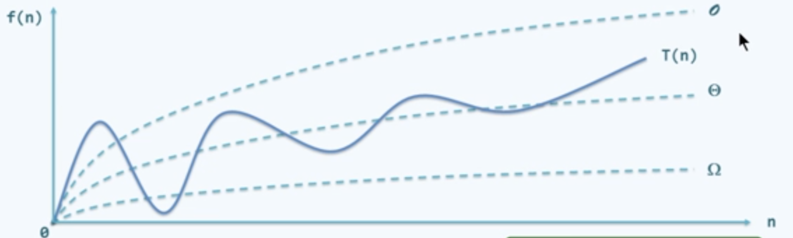
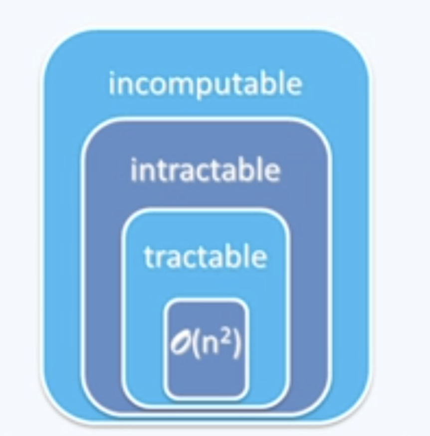
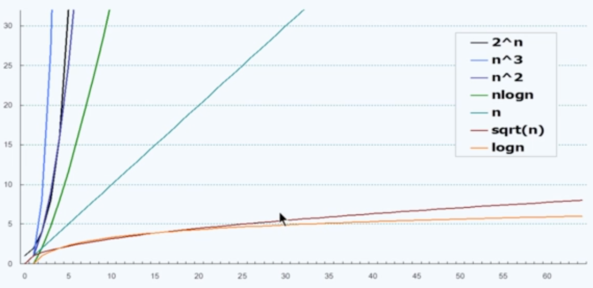

# 📘 渐进复杂度 (Asymptotic Complexity)

> 本章笔记基于《数据结构（邓俊辉）》课程视频，介绍了算法复杂度的渐进分析方法，包括 **大O记号、大Ω记号、大Θ记号** 以及常见复杂度类别，从常数时间到指数时间，并通过实例（如子集问题）说明其实际意义。

---

## 🧠 本节核心概念

* 渐进分析（Asymptotic Analysis）
* 大O记号（Big-O Notation）
* 大Ω记号（Big-Omega Notation）
* 大Θ记号（Big-Theta Notation）
* 常见复杂度类别：

  * O(1) 常数时间
  * O(log n), O(log^c n) 对数型
  * O(n^c) 多项式时间
  * O(2^n) 指数时间
* NP-Complete 示例：2-Subset 问题
* 增长率比较

---

## ✅ 渐进分析 (Asymptotic Analysis)

**定义 / 理论**

* 研究算法在 **问题规模 n 足够大时** 的计算成本随 n 的增长趋势。
* 关注主要、长远的变化趋势，而非局部、细微、暂时的波动。

**公式与符号**

* 基本操作次数：T(n)
* 存储单元需求：S(n)

**注意点**

* ⚠️ 局部波动、暂时趋势不重要，只看长期主导项。
* ⚠️ 主要用于大规模问题的分析。

---

## ✅ 大O记号 (Big-O Notation)

**定义 / 理论**

* T(n) = O(f(n)) ⇔ ∃c>0, 当 n≫2 时, T(n) < c·f(n)
* 表示算法增长率的 **上界**。

**示例公式**

$$
\sqrt{5n \cdot [3n \cdot (n+7) + 4] + 6} < 35n^3 + 6n^{1.5} = O(n^{1.5})
$$

**注意点**

* ⚠️ 常数因子可忽略：O(f(n)) = O(c·f(n))
* ⚠️ 低次项可忽略：O(n^a + n^b) = O(n^a), a > b > 0

---

## ✅ 大Ω与大Θ记号 (Ω & Θ Notation)

**定义 / 理论**

* 大Ω：T(n) ≥ c·f(n)，给出 **下界**。
* 大Θ：c₁·f(n) ≤ T(n) ≤ c₂·f(n)，给出 **紧确界**。

**图示**


**说明**


* Θ 表示上下都被 f(n) 夹住，更精确。

---

## ✅ 常数时间 O(1)

**定义 / 理论**

* 只需有限步即可完成的操作。

**示例代码**

```cpp
int a = 2;             // O(1)
int b = 2013*2013;     // O(1)
if ((n+m)*(n+m) < 4*n*m) goto UNREACHABLE; // O(1)
```

**注意点**

* ⚠️ 不一定要求“没有循环/分支/递归”，关键在于操作次数不随 n 增长。
* ⚠️ 包括 RAM 中的基本操作。

---

## ✅ 对数型 O(log n), O(log^c n)

**定义 / 理论**

* log 的**底数不影响复杂度**：log\_a n = Θ(log\_b n)
* **常数次幂不影响**： (log n)^c = Θ(log n)

**特点**

* 算法非常高效，复杂度接近常数。

**示例**

* 二分查找：O(log n)

---

## ✅ 多项式时间 O(n^c)

**定义 / 理论**

* 多项式表达式：a\_k n^k + … + a₁ n + a₀ = O(n^k)

**特点**

* 编程题的主要范围：O(n) \~ O(n^2)
* 被认为是“可解问题”的标准。

**注意点**

* ⚠️ n^c（c>0）属于多项式复杂度，通常可接受。

---

## ✅ 指数时间 O(2^n)

**定义 / 理论**

* T(n) = a^n (a>1)
* 增长极快，通常被认为不可接受。

**特点**

* 从多项式 O(n^c) 到指数 O(2^n)，是 **有效算法与无效算法的分界线**。

**图示**


---

## ✅ 指数时间复杂度例子 — 2-Subset

### 问题描述

* 输入：集合 S 含 n 个正整数，是否存在一个子集 T，使得

  $$
  \sum_{x \in T} x = m
  $$
* 经典类比：给定一个集合 $S$，其中的每个元素对应一个州的 **选举人票数**。

  * 例如：$S = \{55, 38, 29, 20, 3, \dots\}$，这里的 55 代表加州，加州有 55 张选举人票。
* 目标：是否存在一个子集 $T \subseteq S$，使得 $\sum_{x \in T} x = m$。
* 在美国总统选举的例子中：

  * 总共有 538 张选举人票。
  * 如果候选人 A 的票数是某个子集 $T$ 的和，B 的票数是剩余票数。
  * 设 $m=269$，问题就是：是否存在若干个州的组合，使得它们的选举人票数之和为 269 —— 这对应了大选可能出现的 **269:269 平局局面**。

**复杂度**

* 直觉解法：枚举所有 2^n 个子集 → O(2^n)
* 没有其他更优化解法，2-subset 不存在在多项式时间内解决问题的算法
*因此也叫NP-complete问题


---

## ✅ 增长率比较

**定义 / 理论**

* 算法复杂度的增长速度差别极大。
* 从高效到低效依次为：
  O(1) < O(log n) < O(√n) < O(n) < O(n log n) < O(n²) < O(n³) < O(2ⁿ)

**图示**


**注意点**

* ⚠️ 对比时只看主导项，低次项忽略。
* ⚠️ 这张图直观展示了为什么指数复杂度不可接受。

---

## 🔑 小结

* 渐进分析关注 **n→∞ 的趋势**。
* 大O表示上界，Ω表示下界，Θ表示紧确界。
* 常见复杂度从高效到低效：O(1) → O(log n) → O(n) → O(n log n) → O(n²) → O(2^n)。
* 多项式时间通常可接受，指数时间通常不可接受。
* NP 完全问题目前无法在多项式时间内解决。

---

## 📌 考试速记版

* **忽略低次项与常数**：只保留主项。
* **O 上界，Ω 下界，Θ 精确界**。
* **log 底数无关，幂次可合并**。
* **多项式=可解，指数=不可解**。
* **复杂度速排**：O(1) < log n < √n < n < n log n < n^2 < n^3 < 2^n。

---