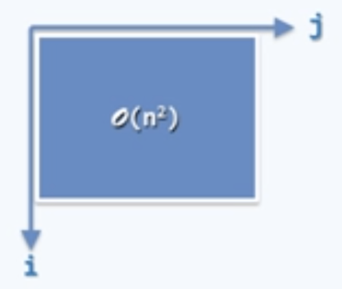
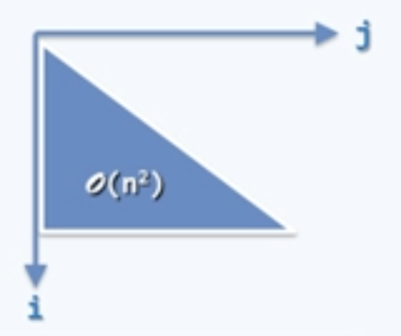
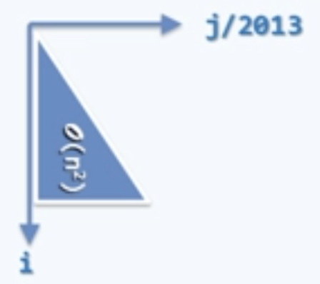
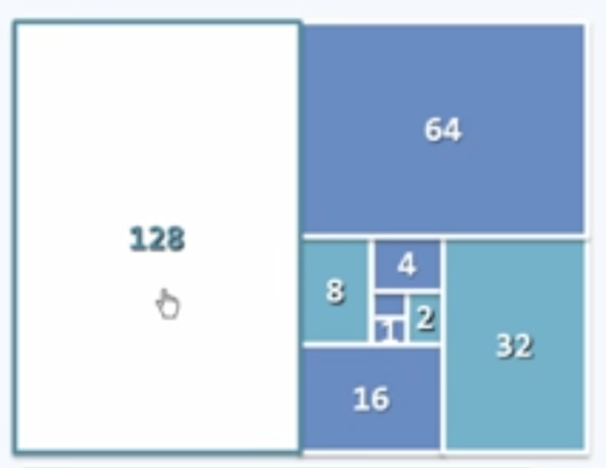
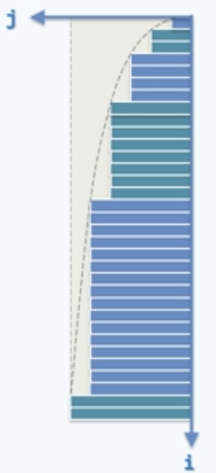
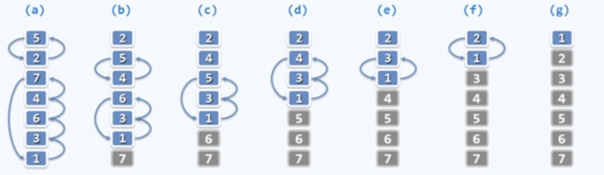
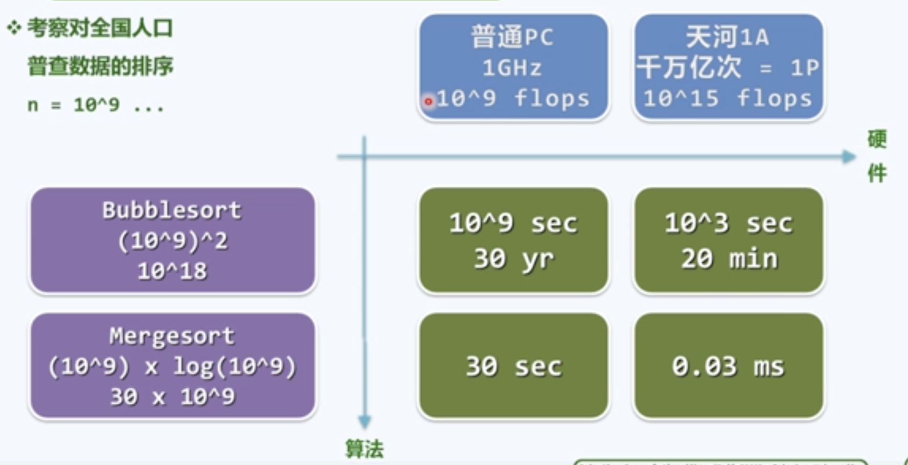

# 📘 Chapter 1.d 算法分析 (Algorithm Analysis)

---

## 🧠 本节核心概念

* 算法分析的两个任务：正确性、复杂度
* RAM 模型与基本指令
* 复杂度分析的三种方法
* 常见级数及复杂度推导
* 循环与复杂度关系
* 例子：取非极端元素
* 例子：冒泡排序
* 粗略计算（Back-of-the-Envelope Calculation，粗略计算）

---

## ✅ 算法分析的任务 (Tasks of Algorithm Analysis)

**定义 / 理论**

* 算法分析有两个核心任务：

  1. **分析正确性**：不变性和单调性
  2. **分析复杂度**：度量算法在输入规模 $n$ 下的时间或空间开销。

* **如何分析复杂度？**：高级语言语句可以大体转化为 RAM 基本指令来计算指令数

  * **分支**：本质是 `goto`。
  * **循环**：本质是 “if + goto”。
  * **递归**：本质也是 `goto`，只是以函数调用的形式实现。

* **复杂度分析的三种方法**：

  1. 迭代：通过级数求和。
  2. 递归：递归跟踪 + 写出递推方程并解。
  3. 猜测 + 验证：先提出形式，再通过数学方法确认。

---

## ✅ 常见级数 (Common Series)

**定义 / 理论**

* 在分析复杂度时，经常需要用到常见级数：

  * **算术级数**：
    1. $1+2+...+n = O(n^2)$
  * **幂方级数**：
    1. $1^d + 2^d + ... + n^d = O(n^{d+1})$
  * **几何级数**：
    1. $1+a+a^2+...+a^n = O(a^n)$
    2. $1 + 2 + 4 + \dots + 2^n = 2^{n+1} - 1 = O(2^{n+1}) = O(2^n)$
  * **收敛级数**：
    1. $\frac{1}{1\cdot2} + \frac   {1} {2\cdot3} + \frac{1}{3\cdot4} + \dots + \frac{1}{(n-1)n} = 1 - \frac{1}{n} 
    = O(1)$
    2. $ 1 + \frac{1}{2^2} + \dots + \frac{1}{n^2} < 1 + \frac{1}{2^2} + \dots 
    = \frac{\pi^2}{6} = O(1)$
    3. $ \frac{1}{3} + \frac{1}{7} + \frac{1}{8} + \frac{1}{15} + \frac{1}{24} + \dots = 1 = O(1)$
    4. $(1-\lambda)\cdot [1 + 2\lambda + 3\lambda^2 + 4\lambda^3 + \dots] 
    = \frac{1}{1-\lambda} 
    = O(1), \quad 0 < \lambda < 1$
  * **调和级数**：$1+1/2+1/3+...+1/n = \Theta(\log n)$
  * **对数级数**：$\log 1 + \log 2 + ... + \log n = \Theta(n \log n)$

**注意**
- ⚠️ 存在 $(1-\lambda)\cdot [1 + 2\lambda + 3\lambda^2 + 4\lambda^3 + \dots] 
= \frac{1}{1-\lambda} 
= O(1), \quad 0 < \lambda < 1$ 中操作数可以是分数? 
- 存在！ 例子: 投掷硬币，正反面会执行不同操作

---

## ✅ 循环与复杂度 (Loops & Complexity)


### 🧠 双层循环 — $O(n^2)$

```cpp
for (int i = 0; i < n; i++)
    for (int j = 0; j < n; j++)
        O1Operation(i, j);
```

**算术级数：**

$$
\sum_{i=0}^{n-1} n = n + n + \cdots + n = n \times n = O(n^2)
$$
<div align="center">
  
</div>


---

### 🧠 双层嵌套（内层与 i 有关）

```cpp
for (int i = 0; i < n; i++)
    for (int j = 0; j < i; j++)
        O1Operation(i, j);
```

**算术级数：**

$$
\sum_{i=0}^{n-1} i = 0 + 1 + \cdots + (n-1) = \frac{n(n-1)}{2} = O(n^2)
$$

<div align="center">
  
</div>


---

### 🧠 几何级数  $O(n)$

```cpp
for (int i = 1; i < n; i <<= 1)
    for (int j = 0; j < i; j++)
        O1Operation(i, j);
```
<div align="center">
  
</div>


**几何级数：**

$$
1 + 2 + 4 + \cdots + 2^{\lfloor \log_2(n-1) \rfloor} 
= \sum_{k=0}^{\lfloor \log_2(n-1) \rfloor} 2^k 
= 2^{\lfloor \log_2 n \rfloor + 1} - 1 = O(n)
$$
<div align="center">
  
</div>


---

### 🧠 对数级数  $O(n \log n)$

```cpp
for (int i = 0; i <= n; i++)
    for (int j = 1; j < i; j += j)
        O1Operation(i, j);
```

**几何级数：**

$$
\sum_{k=0}^n \lceil \log_2 i \rceil = O(n \log n)
$$

展开过程：

$$
= 0 + 0 + 1 + 2 \times 2 + 3 \times 4 + 4 \times 8 + \cdots
$$

$$
= \sum_{k=0}^{\log n} k \times 2^{k-1}
= O(\log n \cdot 2^{\log n}) = O(n \log n)
$$

<div align="center">
  
</div>

---


## ✅ 取非极端元素 (Finding a Non-Extreme Element)

**定义 / 理论**

* **问题**：给定一个整数集合 S，元素数量 $\geq 3$，找一个既不是最大也不是最小的元素。
* **算法**：任取三个不同的数，去掉最大和最小，输出剩下的那个。
* **复杂度**：无论 n 多大，步骤数固定 → $\Theta(1) = O(1) = \Omega(1)$


---

## ✅ 知识点 5：冒泡排序 (Bubble Sort)

**定义 / 理论**

* **问题**：输入 n 个整数，输出按非降序排列的结果。
* **过程**：

  * 从头到尾扫描，相邻元素若逆序则交换。
  * 重复多轮，每一轮把一个最大元素“冒泡”到末尾。
* **性质**：

  * **不变性**：第 k 轮后，最大的 k 个元素有序就位。
  * **单调性**：无序区间逐渐缩小。
  * **正确性**：至多 n 轮，算法一定完成排序。
* **复杂度**：

  * 每轮 $\Theta(n)$，共 n 轮 → $\Theta(n^2)$。

**伪代码**
```cpp
void bubblesort(int A[], int n) {
    for (bool sorted = false; sorted = !sorted; n--) {  
        // 逐趟扫描交换，直到完全有序
        for (int i = 1; i < n; i++) {  
            // 自左向右，逐对检查 A[0, n) 内各相邻元素
            if (A[i - 1] > A[i]) {  
                // 若逆序，则交换
                swap(A[i - 1], A[i]);  
                sorted = false;       // 清除（全局）有序标志
            }
        }
    }
}
```

**图示**
<div align="center">
  
</div>

---

## ✅ 粗略计算 (Back-of-the-Envelope Calculation, 粗略计算)

**定义 / 理论**

* **概念**：用简单近似快速估算数量级。
* **历史例子**：

  * 埃拉托色尼估算地球周长。
  * 费米提出“费米估算”，能在纸上快速推算数量级。
* **时间数量级换算**：

  * 一天 ≈ $10^5$ 秒
  * 一生 ≈ $10^9$ 秒
  * 300 年 ≈ $10^{10}$ 秒
* **应用对比**：排序全国人口 $n=10^9$：

**图示**

<div align="center">
  
</div>

---

## 🔑 小结

* 算法分析关注 **正确性** 和 **复杂度**。
* **RAM 模型** 提供统一度量。
* 三种分析方法：迭代、递归、猜测+验证。
* 常见级数与循环形式要熟记。
* 例子：取非极端元素 $O(1)$，冒泡排序 $O(n^2)$。
* **粗略计算** 能直观展示复杂度差异远大于硬件差异。


