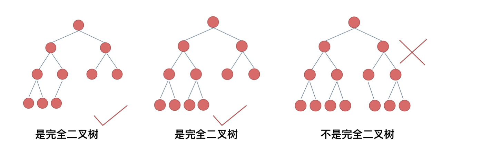

# 完全二叉树的节点个数 — count nodes

- **题目（LeetCode 222）**： [🔗 题目](https://leetcode.cn/problems/count-complete-tree-nodes/description/)  
- **难度**：简单
- **解析 / 学习链接**： 
   
    - [🧠 文字解析（代码随想录）](https://programmercarl.com/0222.%E5%AE%8C%E5%85%A8%E4%BA%8C%E5%8F%89%E6%A0%91%E7%9A%84%E8%8A%82%E7%82%B9%E4%B8%AA%E6%95%B0.html#%E7%AE%97%E6%B3%95%E5%85%AC%E5%BC%80%E8%AF%BE)
    - [🎥 视频讲解（代码随想录）](https://bilibili.com/video/BV1eW4y1B7pD/)

---
## 关键点（精简）

- **完全二叉树性质**
    - **只有最后一层可能不满，除最后一层外**，上面所有层都必须达到最大节点数（第 k 层有 2k 个节点）
    - **最后一层的节点可以不满，但必须全部集中在左侧**
    

