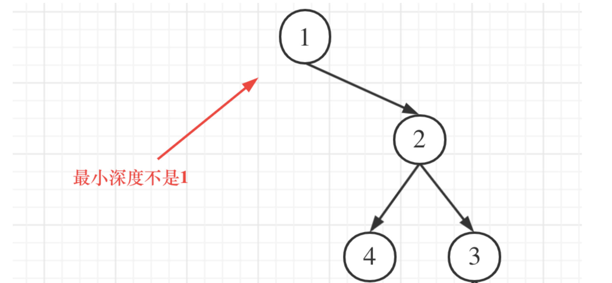

# 二叉树最小深度 — min depth

- **题目（LeetCode 111）**： [🔗 题目](https://leetcode.cn/problems/minimum-depth-of-binary-tree/description/)  
- **难度**：简单
- **解析 / 学习链接**： 
   
    - [🧠 文字解析（代码随想录）](https://programmercarl.com/0111.%E4%BA%8C%E5%8F%89%E6%A0%91%E7%9A%84%E6%9C%80%E5%B0%8F%E6%B7%B1%E5%BA%A6.html#%E7%AE%97%E6%B3%95%E5%85%AC%E5%BC%80%E8%AF%BE)
    - [🎥 视频讲解（代码随想录）](bilibili.com/video/BV1QD4y1B7e2/)

---
## 关键点（精简）

**核心思路 -- 递归求最小深度**
- 本题思路和 [求最大深度](./binary_tree_8_max_depth.md) 基本一样
- 唯一区别就是**如果子树为空的时候，该子树不能纳入到考虑范畴中**，原因如下图

- 因此多一道工序：如果某子树为 `nullptr` 而另一边非 `nullptr`，则取非 `nullptr` 的子树深度


**核心思路 -- 遍历求最小深度**

- 与 [求最大深度](./binary_tree_8_max_depth.md) 一样本题也可以使用层序遍历
- 但是差别在于终止条件不同了：**第一次遇到叶子节点时立即返回当前层数**，即为最小深度。

    - **为什么遇到叶子立即返回？** 层序遍历保证浅层节点先被访问，第一个叶子所在的深度就是所有根到叶路径中的最短者

1. **叶子节点的严格定义**
   - 必须同时满足 `!left && !right`，仅有一个子节点的节点**不是**叶子
   - 反例：树 `1 -> 2`（只有左子节点），最小深度是 2，不是 1

2. **层数计数时机**
   - `++depth` 放在 `for` 循环之前，表示即将处理的是**新的一层**
   - 代码对应：`while` 每迭代一次，队列中恰好存储同一层的所有节点

3. **提前终止的必然性**
   - 一旦 `return depth`，后续节点无需访问，时间优于必须递归到底的 DFS
   - 场景：满二叉树中，最短叶子在第二层，BFS 只需访问根 + 2 个子节点即可结束

4. **空树的隐式处理**
   - `root` 为空时队列不进入 `while`，直接 `return 0`，符合空树深度定义

**记忆口诀**：*层序遍历一层层，左右皆空即叶子；首个叶子深度现，BFS 截断最省事。*


---
## 代码实现

**递归方法**

```cpp
class Solution {
public:
    int minDepth(TreeNode* root) {

        if (root == nullptr ) return 0; 

        if (!root->left && root -> right ) return 1 + minDepth(root->right); 
        else if (!root->right && root -> left ) return 1 + minDepth(root->left);
        return 1 + min(minDepth(root->left), minDepth(root->right)); 
        
    }
};
```

**遍历方法**


```cpp
class Solution {
public:
    int minDepth(TreeNode* root) {
        queue<TreeNode*> q;
        if (root) q.push(root);          // 空树直接跳过循环，返回 0
        
        int depth = 0;
        while (!q.empty()) {
            ++depth;                      // 进入新的一层，深度先加 1
            
            // 阶段1: 消耗当前层全部节点
            for (auto i = q.size(); i != 0; --i) {
                auto checkpoint = q.front(); q.pop();
                
                // 阶段2: 子节点入队（为下一层做准备）
                if (checkpoint->left)  q.push(checkpoint->left);
                if (checkpoint->right) q.push(checkpoint->right);
                
                // 阶段3: 叶子判定 → 首个叶子即最小深度
                // ⚠️ 必须左右皆空，单支节点不是叶子
                if (!checkpoint->left && !checkpoint->right) return depth;
            }
        }
        return depth;  // 空树时走到这里，返回 0
    }
};
```
